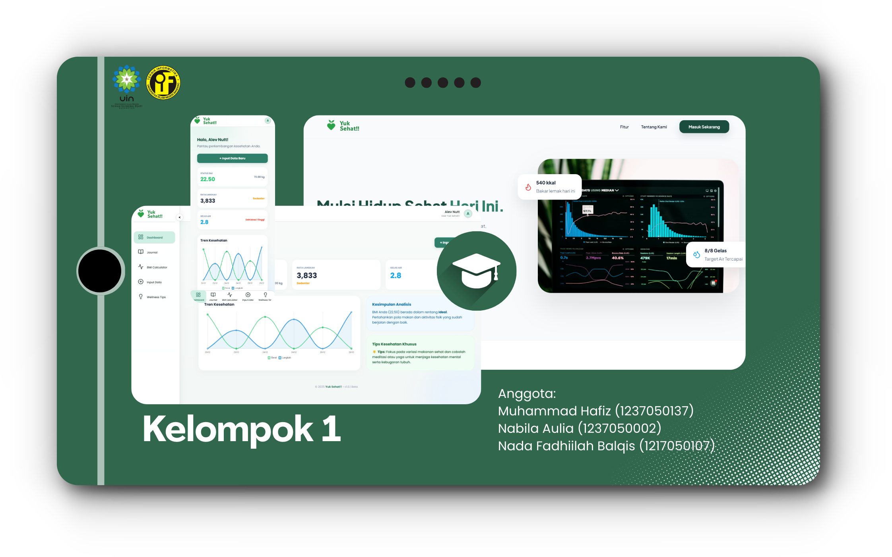

# Progressive Web Application
    

  
  

# Yuk Sehat!! | Jurnal Kesehatan

**Yuk Sehat!!** adalah platform kesehatan yang dirancang untuk membantu pengguna mengelola data pola hidup termasuk program diet dengan lebih terukur. Website ini memudahkan pencatatan aktivitas olahraga dan perhitungan indeks masa tubuh. Dengan fitur pemantauan BMI harian dan grafik perkembangan transparan, setiap progres kecil terdokumentasi dengan sempurna untuk mendukung transformasi kesehatan pengguna.

## Topik dan Motivasi

Proyek ini hadir sebagai instrumen transformasi personal yang mengubah setiap aktivitas fisik dan perhitungan indeks masa tubuh menjadi data yang bermakna. Melalui sistem pencatatan *langkah kaki* dan jurnal perhitungan BMI yang terintegrasi, pengguna dapat melihat bagaimana konsistensi harian—sekecil apa pun usaha yang dilakukan—berakumulasi menjadi perubahan nyata pada komposisi tubuh dan angka BMI mereka.

Tujuannya adalah membangun **motivasi berbasis progres (Progress-Based Motivation)**. Dengan visualisasi perkembangan yang transparan, pengguna tidak lagi menebak-nebak hasil, melainkan didorong oleh bukti nyata dari usaha mereka sendiri untuk mencapai kesehatan optimal dan perbaikan diri yang berkelanjutan.

## 🚀 Fitur Utama
**PWA Ready:** Mendukung instalasi di perangkat Android/iOS dan Desktop untuk akses instan tanpa melalui browser.
* **Dashboard:** Visualisasi grafik perkembangan pencatatan aktivitas dan berat badan.
* **Journal:** Kumpulan hasil pencatatan aktivitas dan indeks masa tubuh.
* **BMI Calculator:** Kalkulator perhitungan indeks masa tubuh.
* **Input Data:** Pemasukan data hasil aktivitas.
* * **Wellness Tips:** Beberapa tips kesehatan.

## 🛠️ Teknologi yang Digunakan
| Komponen | Teknologi |
| :--- | :--- |
| **Language** | [PHP](https://www.php.net/) |
| **Framework** | [Laravel 10+](https://laravel.com/) |
| **Database** | [MySQL](https://www.mysql.com/) |
| **Deployment** | [Railway](https://railway.com/) |
| **UI/UX Design** | [Figma](https://www.figma.com/) |

## Tampilan Website

## Tim Kami
1. Muhammad Hafiz (1237050137)
2. Nabila Aulia (1237050002)
3. Nada Fadhiilah Balqis (1217050107)

---

### 🎓 Informasi Akademik
Proyek ini dikembangkan dalam rangka memenuhi tugas mata kuliah yang diampu oleh:
**Dosen Pengampu: Bapak Maulana Hasan M, M.Kom.**

---
© 2025 Yuk Sehat!! Project - Informatics Engineering

